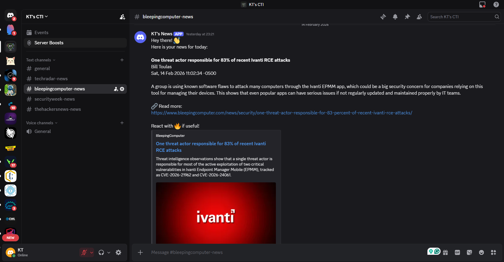
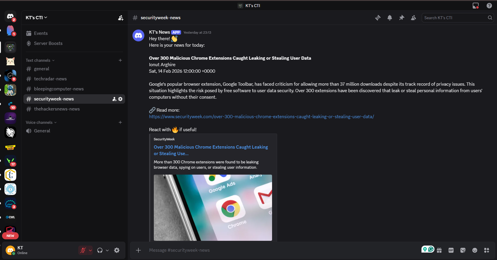
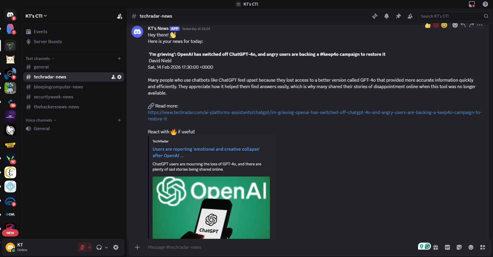
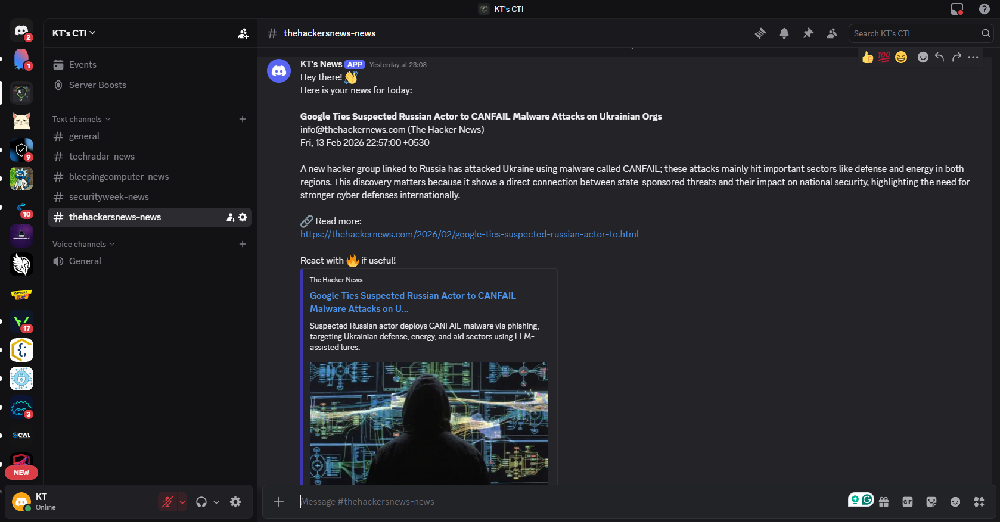

# KT's CTI (Cyber Threat Intelligence) - Automated News Summarizer

An automated system built with **n8n** that monitors Cyber Threat Intelligence (CTI) feeds from multiple sources, summarizes the articles using Local LLMs (**Ollama/Phi3**), and delivers them to **Discord** channels.

> [!TIP]
> **New to n8n or Ollama?** Check out our detailed [A to Z Setup Guide](./GUIDE.md) to get started!

### 📢 Live Updates
Join our Discord server to see the bot in action and get real-time CTI updates:
[**Join KT's CTI Discord**](https://discord.gg/cVkfC9pJ)

## 🚀 Features

- **Multi-Source Monitoring**: Monitors feeds from TechRadar, BleepingComputer, SecurityWeek, and The Hacker News.
- **AI-Powered Summarization**: Uses Local LLMs (Ollama with Phi3) to create concise, easy-to-read summaries.
- **Discord Delivery**: Automatically sends updates to dedicated Discord channels with clickable links.
- **Scheduled Triggers**: Runs automatically at set intervals.

## 🛠️ Technology Stack

- **n8n**: Workflow automation platform.
- **Ollama**: Local execution of LLMs.
- **Phi3**: High-performance local language model.
- **Discord Webhooks**: For real-time notifications.
- **RSS Feeds**: As data sources.

## 📸 Screenshots

### n8n Workflow

### Discord Notifications
| Source | Delivery Preview |
|---|---|
| **Bleeping Computer** |  |
| **Security Week** |  |
| **Tech Radar** |  |
| **The Hacker News** |  |

## ⚙️ Setup Instructions

1. **Prerequisites**:
   - Install [n8n](https://n8n.io/).
   - Install [Ollama](https://ollama.com/) and pull the `phi3:latest` model.
   - Create a Discord Webhook for your channel(s).

2. **Installation**:
   - Download the `KT's CTI.json` file.
   - Import the JSON file into your n8n workspace.

3. **Configuration**:
   - Open each **Discord** node in n8n.
   - Replace the `Webhook URL` (or Credentials) and `Webhook ID` with your own.
   - Ensure the Ollama node is connected to your local instance.

## 📝 License
Feel free to use and modify for personal or educational purposes.
